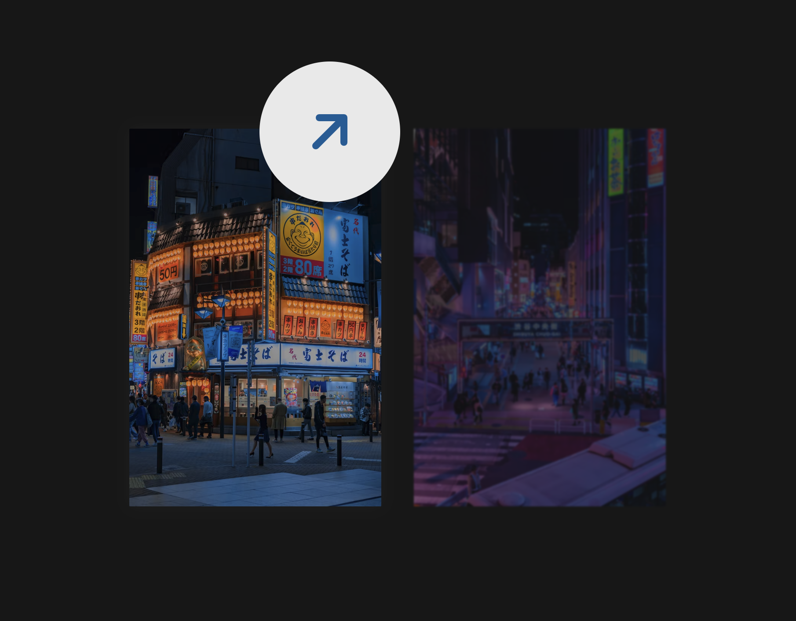

## Activity pointer trailer

> Expanding and interactive mouse trailer using `animate` Web Animations API.



Featuring:

- Our pointer `div` has properties that we going to manipulate in JS.

```css
#pointer {
  height: 20px;
  width: 20px;
  border-radius: 50%;
  background-color: white;
  /* Fixed positioned so it has no effect on elements in normal flow */
  position: fixed;
  /* Zero out starting point to (0, 0) top/left corner (🧙‍♂️ JS will change it) */
  top: 0;
  left: 0;
  /* Ensure that it's the 🥞 topmost element in document. */
  z-index: 9999999;
  /* Ensure no pointer events so clicks and hovers pass-through underneath. */
  /* Otherwise our pointer `div` will conflict with other lower/elements. */
  pointer-events: none;
  opacity: 0;
  transition: opacity 500ms ease;
}
/* https://www.w3schools.com/csSref/css_selectors.php (el > el)*/
body:hover > #pointer {
  /* Next `opacity` trailer in the pointer when you `:hover` document body. */
  opacity: 1;
}
```

- Here we capture pointer activity in the window and stagger with `animate`.

[Web Animations API](https://developer.mozilla.org/en-US/docs/Web/API/Web_Animations_API):

API allows for synchronizing & timing changes to the presentation of a Web page,
like animation of DOM elements. By combining two models:

[Timing Model and the Animation Model] (https://www.smashingmagazine.com/2021/09/orchestrating-complexity-web-animations-api).

We start with the Animation interface and to get an animation object we use the
`Element.animate`. You give it `keyframes` and options to it play your animation
immediately. It also does return an `Animation` object instance. Its purpose is
to control the playback. When you create an animation through `Element.animate`,
you’re using a shortcut that does three things.

1. It creates a `KeyframeEffect` instance. 2) It puts a new Animation instance.
2. It immediately starts playing it.

```js
const animation = element.animate(keyframes, options);
```

If you not using the shortcut, you can break it down and see a equivalent code
that does the same thing:

```js
const animation = new Animation( // (2)
  new KeyframeEffect(element, keyframes, options) // (1)
);
animation.play(); // (3)
```

```js
// Your scripts :)
const pointer = document.getElementById("pointer");
window.onmousemove = (e) => {
  // Capture pointer position as it moves in the window:
  let { clientX, clientY } = e;
  // Pointer element px (h/w) size:
  let { offsetWidth, offsetHeight } = pointer;
  // With the above calc we center our pointer by dividing with its offset!
  let centerX = clientX - offsetWidth / 2;
  let centerY = clientY - offsetHeight / 2;
  // ...
  console.table({
    "mouse 🐭": { clientX, clientY },
    "offset 📏": { offsetWidth, offsetHeight },
    "calc 🧮": { centerX, centerY },
  });
  // ...
  const keyframe = {
    transform: `translate(${centerX}px, ${centerY}px)`,
  };
  pointer.animate(keyframe, {
    duration: 800,
    // ! forward to retain animation state reached at the end
    fill: "forwards",
  });
};
```

- Refactor the listener to its own function `animatePointer`.
- Pass a boolean that determines if the card is active to card with `closest`.

https://developer.mozilla.org/en-US/docs/Web/API/Element/closest

`Element.closest`, the method of the Element interface traverses the element and
its parents (heading toward the document `<html>` root, known as DOM tree) until
it finds a `Node` that matches the specified CSS selector.

Using the `data-#` attribute in each card (our interactive area) we determine if
the appropriate icon `<i>` is set, based on the boolean and set `dataset`.

```js
window.onmousemove = (e) => {
  // Here closest searches up the DOM tree for a given class:
  const card = e.target.closest(".card");
  const active = card !== null;
  const icon = document.getElementById("pointer-icon");
  // console.log({ card, icon, active });
  animatePointer(e, active);

  // Remove icon if card is not `!active` or if proceed to setting icon:
  if (!active) pointer.dataset.type = "remove";
  else pointer.dataset.type = card.dataset.type;
  if (active) icon.className = setIconClass(card.dataset.type);
};
```

Regards, <br />
Luigi Lupini <br />
<br />
I ❤️ all things (🇮🇹 / 🛵 / ☕️ / 👨‍👩‍👧)<br />
